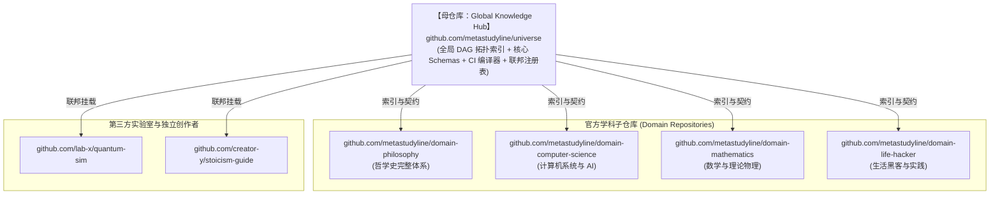

<div align="center">

# 🌐 StudyLine Universe (元学线·知识大宇宙)
### 全人类知识与科学研究的开放协作基础设施 (The Open Knowledge Infrastructure & Graph Engine)

[](https://github.com/metastudyline/universe/actions/workflows/knowledge_ci.yml)
[](https://creativecommons.org/licenses/by-sa/4.0/)
[](https://www.rust-lang.org/)
[](https://json-schema.org/)

**“造钟而非报时，构建可自治演进三十年的人类知识与科研版本控制系统。”**

[哲学白皮书](docs/CONTRIBUTING.md) · [核心契约规范](schemas/) · [快速上手](specs/001-studyline-universal-knowledge-engine/quickstart.md) · [学科子仓库](#-联邦学科子仓库)

</div>

---

## 📖 核心哲学与愿景 (First Principles)

StudyLine（元学线）旨在打破传统教育与科研的碎片化、功利化与黑盒化，构建全人类知识的“GitHub”：

1. **反双重异化 (Anti-Dual Alienation)**：反抗学习流水线式苦役与雇佣劳动的功利中介，回归求知与创造的本真价值。
2. **客观构建主义 (Objectively Constructivist)**：知识的内化是主观建构的根茎网络，但教学与认知受**客观教学依赖关系（DAG 拓扑）**约束。
3. **极简公共契约 + 无限多模态包容**：底层仅强制约束声明式前置依赖与掌握六层次（0-5），允许数学推导、代码沙箱、交互仿真、一手文献与深度视听无限扩展。
4. **联邦式子母仓库体系 (Federated Hub-and-Spoke)**：母仓库维护全局 DAG 总索引与核心契约，各学科独立子仓库自治演进，零供应商锁定。

---

## 🏛 架构与仓库全景 (Architecture Overview)



---

## 🛠 核心技术栈与工具链 (Tech Stack)

- **核心图计算引擎 (`tools/studyline-graph-core`)**：Rust `petgraph` + `roaring-rs` + `rkyv`。10 万节点拓扑排序 $<3\text{ms}$，单源拓扑 DP 最短学线计算 $<2\text{ms}$，导出 WASM 端侧完全离线运行。
- **知识 CI 编译器 (`tools/studyline-compiler`)**：集成 Draft-07 JSON Schema 严格校验、逆向依赖传递闭包（Blast Radius 爆炸半径）分析与 Mermaid 拓扑差分图生成。
- **三层分流安全渲染器 (`packages/studyline-renderer`)**：
  - **Tier 1 (DOMPurify)**: Markdown, KaTeX, Mermaid 毫秒级原生渲染；
  - **Tier 2 (Web Worker + Pyodide)**: Jupyter Python 与 Lean 4 证明本地计算沙箱，60fps 绝不卡顿；
  - **Tier 3 (Sandboxed IFrame)**: GeoGebra, Observable 运行于 `sandbox="allow-scripts"` 独立 `null` 源中，防御 XSS。
- **视听与文本双向联动 (`media_sync.ts`)**：基于 WebVTT `cuechange` 事件，视频播放时平滑滚动高亮讲义段落，点击讲义公式精准反向 Seek 视频秒数。

---

## 🚀 极速开始 (Quick Start)

### 1. 轻量检出单一学科 (Sparse Checkout)
借助 Git Cone 模式，仅拉取感兴趣的学科目录，体积 $<30\text{MB}$：
```bash
./tools/scripts/sparse_clone.sh https://github.com/metastudyline/universe.git my-study domains/philosophy
```

### 2. 运行本地拓扑无环性与 Schema 校验
```bash
cd tools
cargo run -p studyline-compiler -- check --strict
```

### 3. 计算从当前掌握到目标的金色学线
```bash
cargo run -p studyline-compiler -- path \
  --target "philosophy.ancient-greek.arche" \
  --mastered "philosophy.foundation.myth-and-logos"
```

---

## 🤝 贡献与开源治理

欢迎阅读 [贡献指南 (CONTRIBUTING.md)](docs/CONTRIBUTING.md) 了解如何发起知识 PR。  
如果在学习中遭遇任何概念断层，请随时提交 [🚨 教学断层与认知卡点反馈](.github/ISSUE_TEMPLATE/01_pedagogical_breakage.yml)，驱动全人类知识网络自愈。

---

## 📜 知识开源协议 (License)

- **知识与内容资产**：基于 [Creative Commons Attribution-ShareAlike 4.0 International (CC-BY-SA-4.0)](https://creativecommons.org/licenses/by-sa/4.0/) 授权。
- **引擎与工具链代码**：基于 [MIT OR Apache-2.0](LICENSE) 授权。
