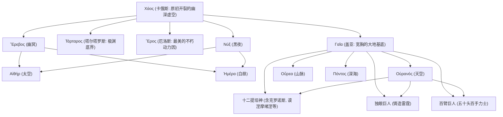

# 出口资产｜《神谱》世代谱系与三次政权更迭机制对照表

> **结课判据验证标准**：能够闭卷默画《神谱》三代神政权更迭机制，说明阉割、吞食、诡计与分职的本质差异，并对比古代近东同构机制。

---

## 一、 三代神政变机制全景对照表

| 世代与主神 | 统治权力特征 | 被篡位/更迭机制 | 宇宙论与空间哲学本质 | 赫梯近东神话同构 (CTH 344) |
| :--- | :--- | :--- | :--- | :--- |
| **第一代：乌拉诺斯 (Οὐρανός, 天空)** | 无限压迫与覆盖，将新生子嗣强行塞回盖亚（大地）幽暗腹中。 | **【暴力阉割】** 盖亚造出灰色坚钢刚镰（ἅρπη），克罗诺斯伏击割断其生殖器抛入大海。 | **【空间开裂与繁衍启动】** 天空与大地被物理强行剥离，Χάος（裂隙空间）展开，生殖力落海涌现阿佛洛狄忒。 | **阿努 (Anu, 天神)**：被库马尔比咬掉并吞下生殖器，失去天界统治。 |
| **第二代：克罗诺斯 (Κρόνος, 时间/收割)** | 吞噬一切新生力量，试图将后代封闭在自身体内以阻断命运。 | **【吞食与石块替身】** 瑞亚以襁褓石块（Omphalos）替换宙斯，宙斯在克里特岛暗中成长，反向逼父吐出诸神。 | **【时间的内闭与逆转】** 时间试图吞噬自身所生之物，但石块阻断了消化，时间被迫吐出历史。 | **库马尔比 (Kumarbi)**：吞下精液与坚硬石块（*kunkunuzzi*），被暴风雨神特舒卜破体而出。 |
| **第三代：宙斯 (Ζεύς, 霹雳/律法)** | 以雷霆与正义为核心，迎娶墨提斯（智慧）并分封众神职责（τιμαί）。 | **【终结篡位循环】** 宙斯将怀孕的墨提斯（智谋）吞入腹中内化为自身智慧，雅典娜从其头颅披甲诞生，击溃提丰。 | **【制度化与永久秩序】** 以政治理性、协商分职与正义（δίκη）取代盲目代际暴力，确立奥林匹斯终极秩序。 | **特舒卜 (Teshub, 暴风雨神)**：使用古代铜锯斩断岩石巨怪乌利库米，确立永恒神权。 |

---

## 二、 核心始基生成脉络图 (116-153行)

