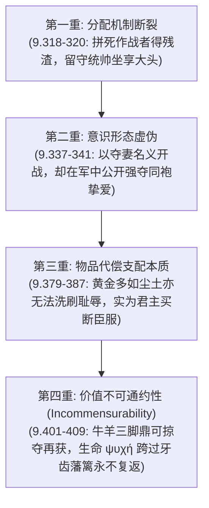

# 出口资产｜荷马史诗荣誉（τιμή）、战利品（γέρας）与命运（μοῖρα）分配逻辑矩阵

> **结课判据验证标准**：能够闭卷解释荷马耻感文化中荣誉为何必须物化确证，严密重构《伊利亚特》卷九使团中阿基琉斯反驳阿伽门农物品补偿的四重逻辑，并阐明价值不可通约性（Incommensurability）。

---

## 一、 荷马社会荣誉分配逻辑矩阵

| 概念与原词 | 词源与本质涵义 | 社会运行与物化确证机制 | 危机爆发点与哲学断裂 | 伦理收敛解 |
| :--- | :--- | :--- | :--- | :--- |
| **`τιμή` (timē, 荣誉/社会份额)** | 评估、尊重、社会地位。 在耻感文化中，无内在超验形态，依赖共同体公开赋予。 | 通过军中议事会集体投票与战功评定，授予公认的特权份额。 | 卷一：阿伽门农依仗权势强夺布里塞伊斯，将阿基琉斯降格为“无尊严的流民（ἀτίμητος）”。 | 卷二十四：普里阿摩斯亲吻弑子仇人之手，阿基琉斯跨越荣誉复仇走向共同必死性的怜悯。 |
| **`γέρας` (geras, 特权战利品)** | 共同体集体授予勇士的特权礼物（战利品、金鼎、战马、女俘）。 | **`τιμή` 在现实中唯一的物化代号**（Physical Token）。剥夺战利品即等同于公开剥夺政治人格。 | 卷九：阿伽门农试图用堆砌海量财富（七座城池、黄金）买断阿基琉斯，建立主奴隶属关系。 | 宣告生命（ψυχή）与战利品在本体论上**绝对不可通约**，拒绝任何商品化折算。 |
| **`μοῖρα` (moira, 命运/配额)** | 源自动词 μείρομαι（分配），原意为“每人应得的一份（portion / lot）”。 | 神明给定的寿命与命运边界；必死性（mortality）是英雄生存论的不可逾越之墙。 | 卷九双重命运抉择（二选一）：特洛伊不朽声名 vs 家乡漫长寿命。 | 确立英雄以生命为代价换取“不朽之名（κλέος ἄφθιτον）”的悲剧性尊严。 |
| **`κλέος` (kleos, 不朽声名)** | 听闻、传颂之声。英雄对抗肉体必死性的唯一精神代偿机制。 | 由游吟诗人（aoidos）在后世城邦广场上代代传唱，保持记忆不灭。 | 当分配体制腐败（“勇士与懦夫同等死亡”），声名体系面临崩溃。 | 经由史诗自我指涉，阿基琉斯的悲剧抗辩本身成为了最不朽的诗篇。 |

---

## 二、 卷九使团阿基琉斯四重反驳逻辑链 (308-429行)

