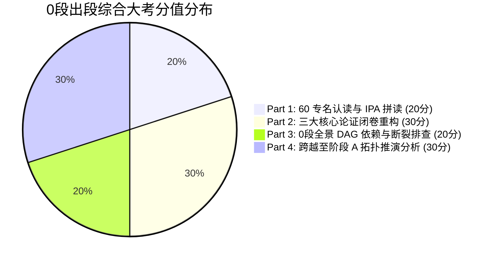

# 0 段全景出段综合大考与掌握度评测大纲 (Stage 0 Comprehensive Exit Exam)

**考核阶段**：`0_myth_and_language` (第一阶段：语言起步与神话思维 · 共94期)  
**出段门槛**：综合得分 $\ge 85$ 分，且三大核心论证重构无断裂。  
**考核形式**：闭卷笔试 + 概念发生学重构 + DAG 拓扑排障。  

---

## 试卷结构与考核维度 (满分 100 分)

---

## Part 1: 60 古希腊专名与概念盲填拼读 (20分)

### 考核目标
测试古希腊语字母（24 个大小写字母）、多调重音（锐音、抑音、扬抑音）、粗气符以及 60 个核心专名/概念词的精确拼写与字面义认读。

### 样题与评分标准
1. **请在 Greek Polytonic 键盘上盲打出下列 5 个词汇并标出正确重音**（每词 2 分，共 10 分）：
   - 卡俄斯（原初开裂虚空）：`Χάος`
   - 正义（划界与法则）：`δίκη`
   - 狂暴（傲慢越界）：`ὕβρις`
   - 特权战利品（荣誉物化代号）：`γέρας`
   - 不成文神圣法则：`ἄγραπτα νόμιμα`
2. **辨析概念原意**（每题 2 分，共 10 分）：
   - 说明 `γένετο` 为何不是 `creatio ex nihilo`（无中生有之创造）；
   - 说明 `μοῖρα` 与动词 `μείρομαι` 的词源联系及其在史诗分配正义中的涵义；
   - 说明 `ψυχή` 在荷马《奥德赛》卷十一与柏拉图《斐多篇》中的本体论差异。

---

## Part 2: 三大核心论证闭卷重构 (30分)

### 论证重构 ①：赫西俄德《劳作与时日》正义比暴力更有利 (10分)
- **要求**：重构 202-285 行鹰与夜莺寓言的四步推演：
  1. 鹰对夜莺宣告纯粹暴力（`βίη`）；
  2. 赫西俄德划出人禽之界（宙斯让动物互食，赐正义与人类）；
  3. 正义女神（`Δίκη`）向宙斯哭诉枉法，行不义之城必遭连带天谴；
  4. 结论：正义具有反身因果必然性，劳动是凡人唯一的正道。

### 论证重构 ②：《伊利亚特》卷九阿基琉斯反驳阿伽门农物品代偿 (10分)
- **要求**：重构 308-429 行的四重逻辑链，并证明生命（`ψυχή`）与战利品（`γέρας`）之间的**价值不可通约性（Incommensurability）**。

### 论证重构 ③：《欧墨尼得斯》战神山平票裁决与正义制度化 (10分)
- **要求**：重构复仇女神血亲诉求与阿波罗胚胎学辩护的法理冲突，阐明雅典娜平票裁决（*Calculus of Minerva*）以及将“恐惧（`to deinon`）”内化为城邦神圣敬畏的政治收编机制。

---

## Part 3: 0 段全景 DAG 依赖与断裂排查 (20分)

### 考核目标
考察学习者能否站在上帝视角鸟瞰 94 期的逻辑递进骨架，准确识别主干节点（Spine）与番外叶节点（Spinoff）。

### 考核题目
1. **主干金色学线追溯**（10分）：
   - 如果学习目标是彻底掌握“前哲学分配正义（`τιμή` 与 `γέρας`）”，请按拓扑依赖顺序写出从 E01 到 E53 的最短必修节点链。
2. **叶节点隔离断言**（10分）：
   - 为什么 X02（赫梯库马尔比史诗）与 X06（口头程式理论）的出度必须严格为 0？如果后续节点强行依赖 X02，会造成什么拓扑破坏？

---

## Part 4: 跨越至阶段 A (前苏格拉底/智者) 拓扑推演 (30分)

### 综合大题（30分）
> **题目**：古希腊早期思想是如何通过**“神话谱系 ➔ 史诗分配 ➔ 悲剧法庭”**这三次接力，最终孕育出阶段 A 的前苏格拉底自然哲学（米利都学派）与智者学派的政治启蒙？
>
> **答题要点提示**：
> 1. 《神谱》的 `Χάος`（物理开裂）如何去拟人化为米利都学派的 `ἀρχή`（自然本原）；
> 2. 《劳作与时日》的 `δίκη / ὕβρις` 如何直接映射为阿那克西曼德宇宙残篇 B1 的元素代偿法则；
> 3. 《伊利亚特》卷一与卷九的 `τιμή / γέρας` 比例如何演变为亚里士多德《尼各马可伦理学》卷五的几何比例分配正义；
> 4. 《安提戈涅》的 `nomos` 与 `agrapta nomima` 之撕裂，如何直接引爆公元前 5 世纪智者学派的“自然（`physis`）与约定（`nomos`）之争”，并最终将苏格拉底推上雅典城邦法庭的审判席。

---

## 结课认证与出段标记
通过本大考后，学习者在 StudyLine 平台的学籍档案中将正式点亮 **`Stage 0: 0_myth_and_language [MASTERED]`** 徽章，并解锁阶段 A（前苏格拉底与古典希腊哲学）全域拓扑画布！
