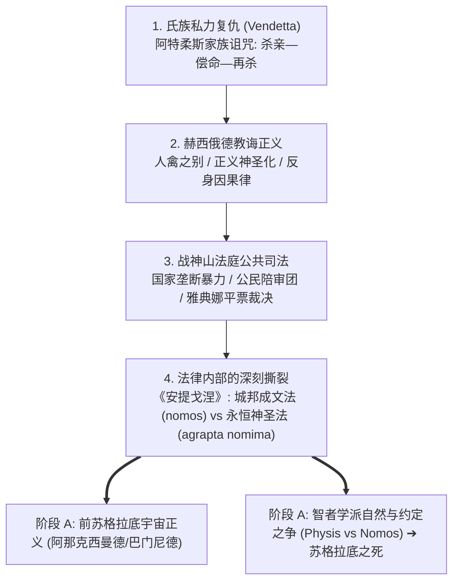

# 出口资产｜古希腊正义制度演进全景图谱 (从血亲复仇到城邦法庭)

> **结课判据验证标准**：能够闭卷复述从荷马史诗血亲复仇（vendetta）到埃斯库罗斯战神山法庭公共司法（Areopagus）、再到索福克勒斯自然神法与实在法冲突的完整演进逻辑。

---

## 一、 古希腊前哲学时期正义制度演进三阶模型

| 发展阶段与文本代表 | 正义核心形态 | 裁决依据与动力因 | 制度困境与危机 | 解决与超越机制 |
| :--- | :--- | :--- | :--- | :--- |
| **第一阶段：荷马史诗与氏族社会** 《伊利亚特》《奥德赛》 | **血亲私力救济 (Vendetta)** 与荣誉战利品分配（`τιμή / γέρας`）。 | 血亲复仇义务（`homaimos`）与死者血金（`poinē`）私相协商。 | **无休止的血仇死循环**：阿伽门农杀女 ➔ 妻子杀夫 ➔ 儿子弑母，无法自我终止。 | 卷十八阿基琉斯之盾：引入公共集会（`agorē`）与知情仲裁官（`istōr`）初型。 |
| **第二阶段：赫西俄德教诲诗** 《劳作与时日》 | **客观宇宙因果律** （`δίκη` 对抗 `ὕβρις` 与掠夺）。 | 宙斯的万名神圣监察使者，反身因果必然性。 | **世俗司法腐败**：“吞噬贿赂的王者”做出弯曲判决（`σκολιαὶ δίκαι`）。 | 将正义神圣化为宙斯之女，诉诸劳动德性与全城天谴的连带责任。 |
| **第三阶段：雅典古典悲剧** 埃斯库罗斯《奥瑞斯忒亚》 索福克勒斯《安提戈涅》 | **城邦公共法庭制度化** 与自然法 vs 实在法辩难。 | 战神山公民陪审团投票（`psephoi`）与神圣敬畏（`to deinon`）。 | 1. 票数均等僵局； 2. 成文政令（`nomos`）与永恒神法（`agrapta nomima`）的不可调和撕裂。 | 1. 雅典娜平票推定无罪（*Calculus of Minerva*）并收编复仇女神； 2. 悲剧作为城邦思考装置，推动走向哲学理性反思。 |

---

## 二、 正义演进拓扑图

