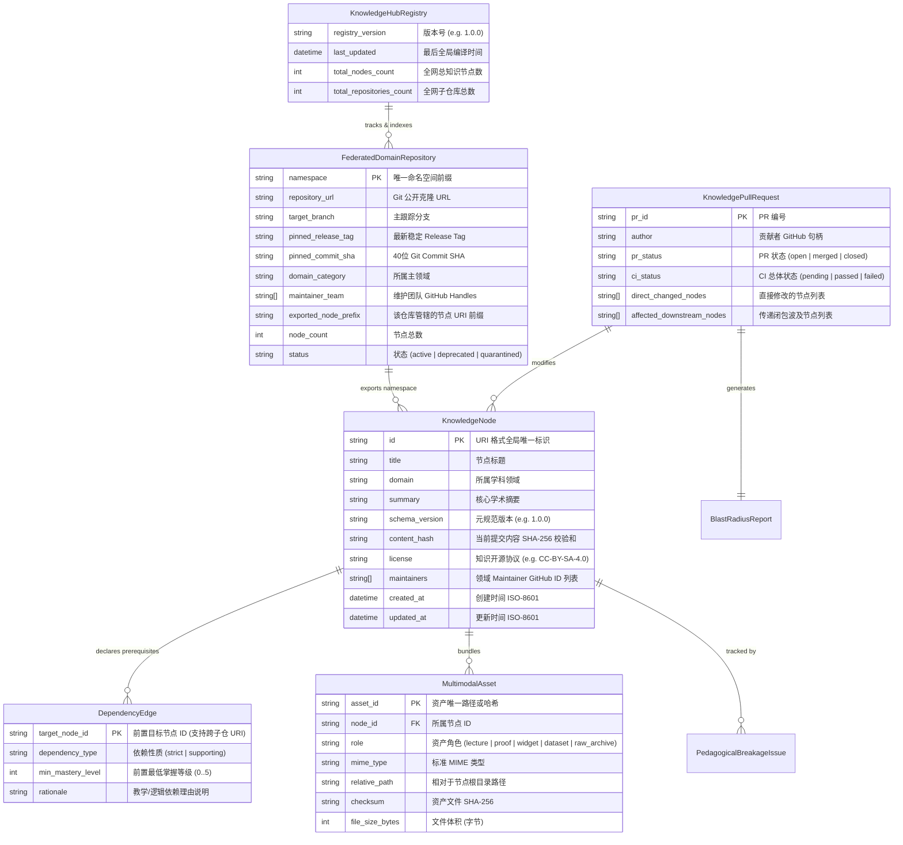

# Data Model: StudyLine Universal Knowledge & Research Open Infrastructure

**Feature Identifier**: `001-studyline-universal-knowledge-engine`  
**Status**: Revised (Federated Hub-and-Spoke Entities Added)  
**Created**: 2026-08-17  

---

## 1. 实体关系全景 (Entity-Relationship Overview)

---

## 2. 实体规格与字段定义 (Entity Specifications)

### 2.1 `KnowledgeHubRegistry` (母仓库注册表)
- **描述**：母仓库 `universe` 中维护的全局联邦注册表实体，对应 `registry.yml`。
- **字段定义**：
  | 字段名 | 类型 | 必填 | 约束 / 枚举 / 格式 | 说明 |
  | :--- | :--- | :---: | :--- | :--- |
  | `registry_version` | `string` | 是 | SemVer (e.g. `1.0.0`) | 注册表格式版本 |
  | `last_updated` | `string` | 是 | Format: `date-time` (ISO-8601) | 全局大图最后编译生成时间 |
  | `domain_repositories` | `FederatedDomainRepository[]` | 是 | MinItems: 1 | 全网登记的子仓库清单 |

---

### 2.2 `FederatedDomainRepository` (联邦学科子仓库)
- **描述**：各个独立学科团队或机构维护的子仓库描述。
- **字段定义**：
  | 字段名 | 类型 | 必填 | 约束 / 枚举 / 格式 | 说明 |
  | :--- | :--- | :---: | :--- | :--- |
  | `namespace` | `string` | 是 | Pattern: `^[a-z0-9-]+$` (e.g. `philosophy`, `cs-systems`) | 唯一短命名空间 |
  | `repository_url` | `string` | 是 | Format: `uri` (e.g. `https://github.com/studyline/domain-philosophy.git`) | Git Clone 访问地址 |
  | `target_branch` | `string` | 是 | e.g. `main` | 默认跟踪分支 |
  | `pinned_release_tag` | `string` | 是 | e.g. `v1.2.0` | 锁定的最新稳定 Release 标签 |
  | `pinned_commit_sha` | `string` | 是 | 长度: 40, Hex SHA-1 | 对应的 Git Commit 哈希 |
  | `domain_category` | `string` | 是 | 枚举: `philosophy`, `mathematics`, `computer_science`, `natural_science`, `life_hacker`, `social_science` | 所属主学科大类 |
  | `maintainer_team` | `string[]` | 是 | MinItems: 1 | 负责维护该子仓的 GitHub 团队或专家句柄 |
  | `exported_node_prefix` | `string` | 是 | Pattern: `^[a-z0-9-]+(\.[a-z0-9-]+)*$` | 该仓库管辖的节点 URI 前缀 |
  | `node_count` | `integer` | 是 | $\ge 1$ | 经 CI 验证包含的有效知识节点数 |
  | `status` | `string` | 是 | 枚举: `active`, `deprecated`, `quarantined` | 联邦健康状态 |

---

### 2.3 `KnowledgeNode` (知识节点)
- **描述**：人类知识大仓库的基本原子单元，对应子仓库中的一个开放多模态容器目录。
- **字段定义**：
  | 字段名 | 类型 | 必填 | 约束 / 枚举 / 格式 | 说明 |
  | :--- | :--- | :---: | :--- | :--- |
  | `id` | `string` | 是 | Pattern: `^[a-z0-9-]+(\.[a-z0-9-]+)*$` | 全局唯一语义标识符 |
  | `title` | `string` | 是 | 长度: 2..120 字符 | 节点显示名称 |
  | `domain` | `string` | 是 | 枚举: 6大学科大类 | 一级学科归属 |
  | `summary` | `string` | 是 | 长度: 10..500 字符 | 简短学术/教学摘要 |
  | `schema_version` | `string` | 是 | SemVer (e.g. `1.0.0`) | 元契约版本 |
  | `content_hash` | `string` | 是 | 长度: 64, Hex SHA-256 | 节点资产综合内容哈希 |
  | `license` | `string` | 是 | e.g. `CC-BY-SA-4.0` | 知识开源协议 |
  | `maintainers` | `string[]` | 是 | MinItems: 1 | 负责该节点的维护者句柄 |
  | `prerequisites` | `DependencyEdge[]` | 是 | 数组 (允许为空作为根节点) | 前置依赖关系集合 |
  | `assets` | `MultimodalAsset[]` | 是 | 数组 (至少包含 1 个入口资产) | 挂载的多模态资产清单 |
  | `created_at` | `string` | 是 | Format: `date-time` | 创建时间 |
  | `updated_at` | `string` | 是 | Format: `date-time` | 更新时间 |

---

### 2.4 `DependencyEdge` (依赖关系边)
- **描述**：知识拓扑 DAG 中的有向边，支持同仓库内依赖与跨子仓前置依赖。
- **字段定义**：
  | 字段名 | 类型 | 必填 | 约束 / 枚举 / 格式 | 说明 |
  | :--- | :--- | :---: | :--- | :--- |
  | `target_node_id` | `string` | 是 | 必须在全局母仓索引中真实存在 | 前置依赖节点全局 ID |
  | `dependency_type` | `string` | 是 | 枚举: `strict` (硬性前置), `supporting` (辅助推荐) | 依赖强度 |
  | `min_mastery_level` | `integer` | 是 | 范围: `0` 到 `5` | 下游学习所需的最低掌握层次 |
  | `rationale` | `string` | 否 | 长度: 5..300 字符 | 设立前置关系的认知依据 |
