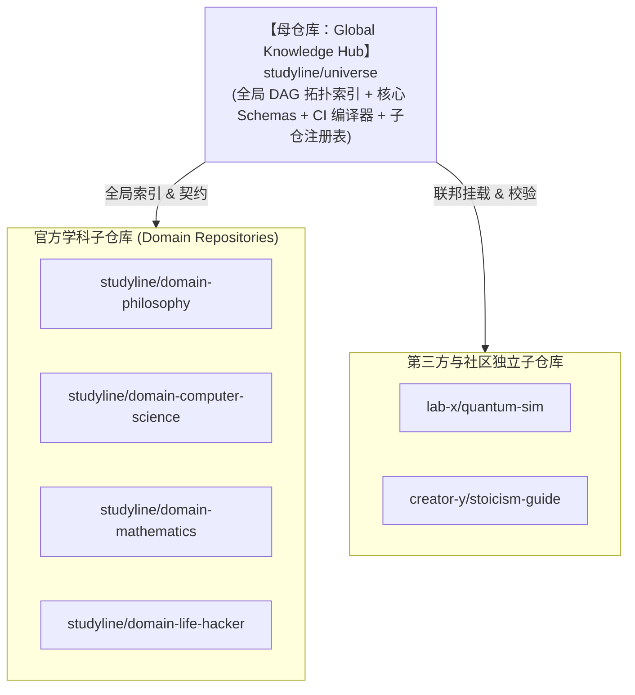

# Feature Specification: StudyLine Universal Knowledge & Research Open Infrastructure (Knowledge GitHub)

**Feature Identifier**: `001-studyline-universal-knowledge-engine`  
**Status**: Revised & Enhanced (Federated Architecture Added)  
**Created**: 2026-08-17  
**Type**: Core Infrastructure & System Whitepaper  

---

## 1. Executive Summary & Vision (执行摘要与愿景)

### 1.1 愿景使命 (Vision & Mission)
人类知识与科学研究天然具有普遍联系与演进特征。然而，当今学术界与数字化教育仍处于“前工业时代”的碎片化状态：科研成果被封锁在孤立、静态、非结构化的 PDF 论文中；在线教育退化为单向视频与快餐式知识付费；AI 教学由于缺乏结构化的“知识世界模型”而陷入不可控的幻觉与单点迷航。

**StudyLine（元学线）的目标是构建全人类知识与科学研究的开放协作基础设施——“知识领域的 GitHub”**。
通过将代码开源领域的版本控制（Git）、包管理（Package Management）、持续集成（CI/CD）与多层级开源社区治理（Maintainers / RFC / PR Review）范式升维至知识与科研领域，StudyLine 打造一个全球连通、基于 DAG（有向无环图）拓扑依赖、支持多模态开放容器（Open Knowledge Container）与**联邦式子母仓库体系（Federated Hub-and-Spoke Architecture）**的超大规模分布式知识网络。

### 1.2 核心哲学基石 (First Principles)
1. **反双重异化 (Anti-Dual Alienation)**：
   - 反抗学习被应试与劳动化（流水线苦役）；
   - 反抗学习沦为未来雇佣劳动的功利中介。让求知与创造回归其自我实现与精神成长的本真价值。
2. **客观构建主义 (Objectively Constructivist)**：
   - “知识结构非绝对，教学结构可寻”。
   - 知识的内化是学习者主动建构的千高原（德勒兹根茎网络），但教学与认知受**线性时间轴**和**客观教学依赖关系**双重约束。
3. **极简公共契约 + 无限多模态包容 (Minimal Manifest & Pluggable Multimodal Facets)**：
   - 基础设施底层仅约束极简的 DAG 依赖拓扑与掌握层次契约；
   - 允许数学推导、代码沙箱、交互仿真、一手文献、深度视听、Jupyter 数据集等无限模态自由插拔共存。
4. **造钟人哲学与基业长青 (Clock Building & Generational Infrastructure)**：
   - 机制优于英雄（机器严苛 CI 执法 + 自动化卡点自愈），原语极简可读，完全去中心化无供应商锁定，保证基础设施三十年自主运转与演进。
5. **联邦式子母仓生态 (Federated Hub-and-Spoke Ecosystem)**：
   - 兼顾“全网全局普遍联系”与“各学科独立自治”。母仓库维护全局 DAG 总索引与契约，子仓库按学科/组织独立自治与发布。

---

## 2. User Scenarios & Core Actors (核心角色与用户场景)

### 2.1 核心参与角色 (Actors)
- **Actor 1: 学习者 / 终身求知者 (Learner)**：希望系统掌握某一领域（如量子计算、德国观念论），需要清晰、连贯、消除迷航的个性化“学线（Study Line）”。
- **Actor 2: 研究者 / 创作者 (Researcher & Creator)**：撰写论文、制作 MODC 数字化教案、构建交互模型，希望将研究成果结构化沉淀并获得全球学术归属认证。
- **Actor 3: 学科子仓库维护者 (Domain Maintainer / CODEOWNER)**：各学科独立子仓库的专家委员会，负责子仓内部的 PR 评审、Issue 看板与版本发布。
- **Actor 4: 母仓库学术指导委员会 (Global Hub TSC)**：维护全网全局 DAG 拓扑索引、核心 Schema 契约与跨学科合并仲裁。
- **Actor 5: AI 教学与推理 Agent (AI Consumer)**：通过标准 API 读取经过 CI 验证的知识拓扑与掌握度约束，为终端用户提供精准无幻觉的路径推演与交互式答疑。

### 2.2 核心用户旅程与用例 (User Stories & Scenarios)

#### Scenario 1: 学习者跨学科全局无缝导航与卡点上报
- **Given**：学习者在 StudyLine 画布中制定了跨越哲学与数学的复合学习路径（如“从古希腊逻辑到形式化自动证明”）。
- **When**：系统从母仓库（`universe`）拉取轻量全局 DAG 拓扑，串联哲学子仓（`domain-philosophy`）与数学子仓（`domain-mathematics`）中的知识节点。学习者在某节点遭遇理解困难。
- **Then**：
  1. 学习者在该节点一键发起“教学卡点（Pedagogical Breakage）”反馈，自动向对应学科子仓库提交 GitHub Issue。
  2. 哲学子仓维护者修复并发布子仓新版本，母仓库自动同步全局索引，全网学线自愈。

#### Scenario 2: 学科团队独立演进与母仓库自动登记
- **Given**：计算机系统团队在独立仓库 `github.com/studyline/domain-computer-science` 中完成了《操作系统底层原理》新章节并打上 Tag `v1.2.0`。
- **When**：子仓 GitHub Action 自动向母仓库 `universe` 提交包含最新节点哈希与元数据的 Registry PR。
- **Then**：
  1. 母仓库运行跨学科全局 CI，验证新增节点未引入全局跨仓循环依赖。
  2. PR 自动合并，母仓库编译生成不可变全局拓扑快照，全球客户端秒级同步。

#### Scenario 3: 第三方实验室/个人学者挂载独立知识库
- **Given**：某大学实验室在自己 GitHub 账号下维护了独立的公开仓库 `github.com/lab-x/quantum-sim`。
- **When**：实验室向母仓库提交登记申请（Registry Entry）。
- **Then**：
  1. 母仓库 CI 校验其符合 `node-manifest.schema.json` 标准。
  2. 合并后，该实验室的量子计算节点正式成为全球知识大网中的合法节点，全球学习者可沿学线无缝导航进入该独立仓库的内容。

---

## 3. 架构与演进策略 (Architecture & Evolution Strategy)

### 3.1 联邦式子母仓库模型 (Federated Hub-and-Spoke Model)

- **母仓库 (`universe`)**：
  - 不存储厚重正文与大型多媒体，仅维护全局元数据、Schemas 契约、全局 DAG 编译器与 `registry.yml`。
  - 体积极小（<50MB），全网广播秒级快照。
- **子仓库 (`domain-*` / 第三方仓库)**：
  - 承载具体学科的多模态知识容器（`manifest.yml`、`index.md`、交互代码、数据集、影印件）。
  - 拥有独立的 Issue 跟踪、Discussions 讨论区、CODEOWNERS 团队与发布周期。

### 3.2 两阶段渐进式演进策略 (Two-Phase Progressive Roadmap)

| 阶段 | 架构形态 | 运作机制 | 适用时期 |
| :--- | :--- | :--- | :--- |
| **阶段一 (MVP / 当前启动期)** | **单仓分目录 Monorepo** | 在 `studyline/knowledge-core` 单仓库内，以 `domains/philosophy/`、`domains/life_hacker/`、`domains/computer_science/` 一级目录组织。 | **0 ~ 1,000 个节点** 验证底层 Schemas、Rust 拓扑引擎与 CI 规则，团队极速迭代零开销。 |
| **阶段二 (Scale / 全球联邦期)** | **Hub-and-Spoke 联邦子母仓** | 将 `domains/*` 抽离为独立子仓库，原单仓转为全局母仓库 `studyline/universe`，开放第三方创作者挂载。 | **1,000+ 节点 / 跨组织生态** 学科完全自治，全球分布式共建。 |

---

## 4. Functional Requirements (功能需求规范)

### 4.1 开放多模态知识容器 (Open Knowledge Container Specification)
- **FR-01 (极简核心契约)**：每个知识节点必须包含一个声明式元数据文件（`manifest.yml` 或 `spec.json`），明确定义全局唯一 ID、标题、摘要、前置依赖关系列表（DAG 边）与最低掌握等级。
- **FR-02 (开放多模态资产插槽)**：知识容器内允许包含任意形态的静态与动态资产（讲义、LaTeX 证明、WASM 控件、Jupyter Notebook、一手文献、音视频元数据）。
- **FR-03 (掌握六层次形式化)**：内置 `无知(0)` ➔ `未知(1)` ➔ `了解(2)` ➔ `使用(3)` ➔ `掌握(4)` ➔ `内化(5)` 状态机，所有依赖边必须明确最低掌握级别。

### 4.2 全局图引擎与联邦编译器 (Federated Topology Engine)
- **FR-04 (跨仓全局 DAG 强一致性校验)**：母仓库编译器在汇聚所有子仓库依赖时，必须在 $<500\text{ms}$ 内完成全网跨仓无环性检测（Cycle Detection）与悬空指针拦截。
- **FR-05 (三元约束学线生成)**：给定学习者状态、目标节点与依赖规则，引擎毫秒级生成跨子仓的最优无断层学线（Study Line）。
- **FR-06 (爆炸半径跨仓分析)**：子仓变更时，母仓 CI 精准计算跨学科受波及的下游依赖节点集合（Blast Radius）。

### 4.3 协作、流水线与版本发布 (Git Workflow & CI)
- **FR-07 (CODEOWNERS 分层权限治理)**：各子仓库配置本学科的 CODEOWNERS，母仓库配置全局 TSC 权限矩阵。
- **FR-08 (自动化知识 CI 检查套件)**：
  - **Schema 强类型校验**：基于 Draft-07 JSON Schema 严格校验。
  - **科学计算沙箱测试**：使用 `uv` + `Papermill` + `pytest-mpl` 自动执行并断言数值与图表一致性。
  - **Mermaid Visual Diff Bot**：在 PR 评论区原地更新受波及局部拓扑对比图。
- **FR-09 (不可变学术快照发布)**：母仓库与子仓库周期性发布带有 Commit SHA 与 DOI 签名的 Release 快照，供全球引用。

### 4.4 客户端与消费生态 (Clients & Ecosystem)
- **FR-10 (NoteBoot 知识终端)**：支持本地优先（Local-First）、一键 `git push`、跨子仓库双向链接。
- **FR-11 (StudyLine 消费前台)**：支持 WebGL 缩放浏览全局知识宇宙、动态挂载三层安全沙箱渲染器。
- **FR-12 (AI Agent 知识总线)**：提供标准 JSON-RPC 接口输出无幻觉的前置依赖与证据链。

---

## 5. Success Criteria & Metrics (端到端成功标准)

- **SC-01 (全局拓扑检索与编译性能)**：在 100 万节点全局大图中，跨仓学线生成耗时 $< 200\text{ ms}$（Rust 拓扑 DP 目标 $< 5\text{ms}$）。
- **SC-02 (CI 自动化拦截率)**：100% 的死链、跨仓循环依赖、Schema 格式错误在 PR 阶段被 CI 拦截。
- **SC-03 (零配置跨模态呈现)**：StudyLine 消费前台加载任意多模态资产的首屏时间 $< 1.5\text{ s}$。
- **SC-04 (轻量按需克隆)**：单个学科子仓库平均克隆体积 $< 50\text{MB}$，秒级完成 `git clone`。
- **SC-05 (去中心化知识主权)**：100% 基于纯 Git 与开放格式，支持 5 分钟无损镜像迁移，无任何商业私有锁死。
