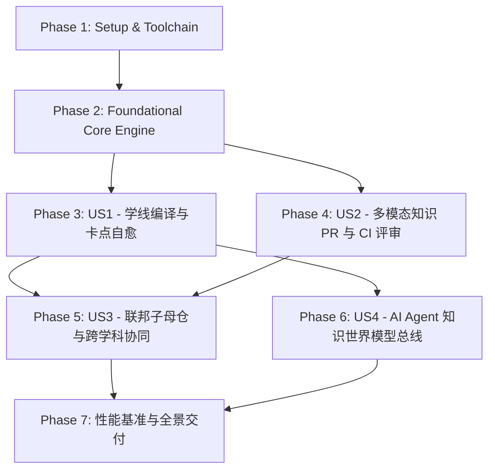

# Tasks: StudyLine Universal Knowledge & Research Open Infrastructure

**Feature Identifier**: `001-studyline-universal-knowledge-engine`  
**Status**: In Implementation (Major Milestones Completed)  
**Created**: 2026-08-17  
**Spec Document**: [spec.md](./spec.md)  
**Plan Document**: [plan.md](./plan.md)  
**Data Model**: [data-model.md](./data-model.md)  
**Contracts**: [contracts/](./contracts/)  

---

## 1. 任务依赖图与故事执行顺序 (Story Dependencies)

---

## 2. 任务清单 (Actionable Tasks)

### Phase 1: Setup & Toolchain Initialization (项目初始化与工程骨架)

- [x] T001 Initialize workspace structure and `.github/CODEOWNERS` in `knowledge-monorepo/.github/CODEOWNERS`
- [x] T002 [P] Initialize Rust workspace with `studyline-graph-core` and `studyline-compiler` in `tools/Cargo.toml`
- [x] T003 [P] Configure Draft-07 JSON Schema validation suite in `schemas/package.json`
- [x] T004 [P] Setup GitHub Actions CI base workflow in `.github/workflows/knowledge_ci.yml`

---

### Phase 2: Foundational Core (核心图计算引擎与契约基石)

- [x] T005 Implement `petgraph` based DAG model and Kahn topological sort in `tools/studyline-graph-core/src/dag.rs`
- [x] T006 [P] Implement Tarjan SCC cycle detection and path trace diagnostics in `tools/studyline-graph-core/src/cycle.rs`
- [x] T007 [P] Implement `rkyv` zero-copy serialization and mmap loader in `tools/studyline-graph-core/src/snapshot.rs`
- [x] T008 [P] Implement Draft-07 Schema validator using `jsonschema-rs` in `tools/studyline-compiler/src/validator.rs`
- [x] T009 [P] Implement unit tests for core graph algorithms in `tools/studyline-graph-core/tests/test_dag.rs`

---

### Phase 3: [US1] 学习者学线编译与卡点自愈 (Learning Path & Breakage Healing)

- [x] T010 [P] [US1] Implement single-source topological DP shortest learning path algorithm in `tools/studyline-graph-core/src/path_planner.rs`
- [ ] T011 [P] [US1] Implement WASM bindings for graph planner using `wasm-pack` in `tools/studyline-graph-wasm/src/lib.rs`
- [x] T012 [US1] Create pedagogical breakage issue template and form in `.github/ISSUE_TEMPLATE/01_pedagogical_breakage.yml`
- [ ] T013 [P] [US1] Implement contract test for `node-manifest.schema.json` in `schemas/tests/test_node_manifest_schema.py`
- [x] T014 [US1] Implement example philosophy foundation node with prerequisites in `domains/philosophy/0_myth_and_language/node_arche/manifest.yml`
- [ ] T015 [US1] Implement integration test verifying end-to-end path resolution in `tools/studyline-compiler/tests/test_path_resolution.rs`

---

### Phase 4: [US2] 研究者多模态知识 PR 与 CI 评审 (Multimodal PR & CI Review)

- [x] T016 [P] [US2] Implement inverted graph transitive closure Blast Radius calculation in `tools/studyline-graph-core/src/blast_radius.rs`
- [x] T017 [P] [US2] Implement Mermaid differential graph exporter with syntax highlighting in `tools/studyline-compiler/src/mermaid_diff.rs`
- [x] T018 [P] [US2] Implement scientific code sandbox runner with `uv`, `Papermill` and `pytest-mpl` in `tools/sci-sandbox/run_reproducibility.py`
- [x] T019 [US2] Implement PR topology visual comment bot workflow in `.github/workflows/pr_diff_bot.yml`
- [ ] T020 [P] [US2] Implement contract test for `knowledge-pr-webhook.schema.json` in `schemas/tests/test_pr_webhook_schema.py`
- [x] T021 [US2] Implement three-tier frontend sandboxed renderer loader in `packages/studyline-renderer/src/sandbox.ts`
- [x] T022 [P] [US2] Implement WebVTT bidirectional audio-text sync engine in `packages/studyline-renderer/src/media_sync.ts`
- [x] T023 [US2] Add reproducible Jupyter notebook knowledge node in `domains/mathematics/linear-algebra/eigenvalues/manifest.yml`

---

### Phase 5: [US3] 联邦子母仓机制与跨学科协同 (Federated Hub-and-Spoke & Cross-Domain)

- [x] T024 [P] [US3] Implement `registry.yml` loader and global graph assembler in `tools/studyline-compiler/src/registry_loader.rs`
- [ ] T025 [P] [US3] Implement contract test for `hub-registry.schema.json` in `schemas/tests/test_hub_registry_schema.py`
- [x] T026 [US3] Implement common ancestor tracking and fork branch resolver in `tools/studyline-graph-core/src/fork_resolver.rs`
- [x] T027 [P] [US3] Implement Sparse-Checkout Cone Mode helper script in `tools/scripts/sparse_clone.sh`
- [ ] T028 [US3] Add cross-domain dependency test between math and philosophy sub-repositories in `tools/studyline-compiler/tests/test_cross_domain.rs`

---

### Phase 6: [US4] AI Agent 知识世界模型总线接入 (AI World Model API)

- [ ] T029 [P] [US4] Implement JSON-RPC 2.0 query server for AI agent topology navigation in `tools/studyline-api/src/server.rs`
- [ ] T030 [P] [US4] Implement contract test for `studyline-render-rpc.schema.json` in `schemas/tests/test_render_rpc_schema.py`
- [x] T031 [US4] Implement Agent contextual prompt generator based on node prerequisites in `tools/studyline-api/src/agent_context.rs`
- [ ] T032 [US4] Add end-to-end integration test for AI Agent topology queries in `tools/studyline-api/tests/test_agent_api.rs`

---

### Phase 7: Polish, Benchmarking & Documentation (性能压测与交付文档)

- [ ] T033 [P] Implement criterion benchmark suite for 100,000 nodes DAG traversal in `tools/studyline-graph-core/benches/bench_graph.rs`
- [ ] T034 [P] Implement link and DOI validator runner using `lychee` in `.github/workflows/link_check.yml`
- [x] T035 [P] Update system architecture whitepaper and contributor guide in `docs/CONTRIBUTING.md`
- [ ] T036 Execute full quickstart validation suite per `quickstart.md` and report metrics
